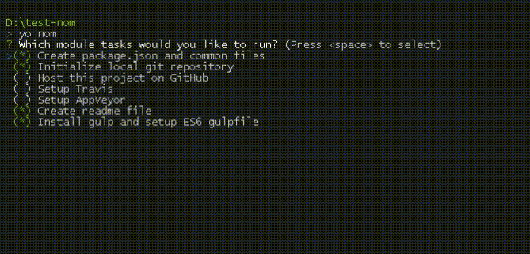

# generator-nom

**A modular [Yeoman](http://yeoman.io) generator to create or update node modules. It's composed of several subgenerators, relatively unopinionated, usable by themselves. Most but not all input values are remembered.**

[](https://www.npmjs.org/package/generator-nom)
[](https://david-dm.org/ironsource/node-generator-nom)



## What It Does

*`yo nom`* will ask you which subgenerators to execute, then executes those in order as listed below. Those you successfully ran before will be disabled by default. Run any of them separately with `yo nom:*`. For example: `yo nom:travis` to just setup Travis.

### `npm`

Create `package.json`, `.gitignore`, install test framework (tape, tap, mocha, grunt, cake, or ava), add `LICENSE` file (MIT, BSD2 or BSD3). If a `package.json` already exists, it will be merged, used for default answers and for sort order of the top-level fields. At deeper levels, like dependencies, nom behaves like npm and sorts lexicographically.

### `git`

Initialize local git repository, unless `.git` directory exists.

### `gitignore`

Create `.gitignore` file, unless it already exists (you can optionally overwrite the existing file).

### `github`

Create public or private GitHub project, named "module-name" or "node-module-name". Unless local git already has configured remotes. Asks for access token and repository owner (which defaults to the owner of the token), skips creation if the repository already exists, adds URLs to `package.json` and adds remote origin.

### `travis`

Add `.travis.yml` for node 0.10 and iojs, setup GitHub hook. The `travis` tool asks for username and password.

### `appveyor`

Add `appveyor.yml` for node 0.10 and iojs, setup GitHub hook. Asks for access token.

### `cli`

Create a CLI app (with [meow](https://github.com/sindresorhus/meow)) and add a `bin` field to `package.json`. Asks for name and path.

### `readme`

Add `readme.md` with common sections and [shield.io](https://shield.io) badges for npm and david. If you did the travis and/or appveyor setup, badges for those services will be added as well.

### `gulp`

Create a gulpfile and `tasks` directory. Installs `gulp`.

## Usage

```
mkdir my-module
cd my-module
yo nom
```

## Install

Install Yeoman and generator-nom globally with [npm](https://npmjs.org):

```
npm i yo generator-nom -g
```

## License

[MIT](LICENSE) © 2015-present [ironSource](http://www.ironsrc.com/). Originally forked from [generator-n](https://www.npmjs.com/package/generator-n) © Andrei Kashcha. Small parts borrowed from [generator-nm](https://github.com/sindresorhus/generator-nm) © [Sindre Sorhus](http://sindresorhus.com/).
